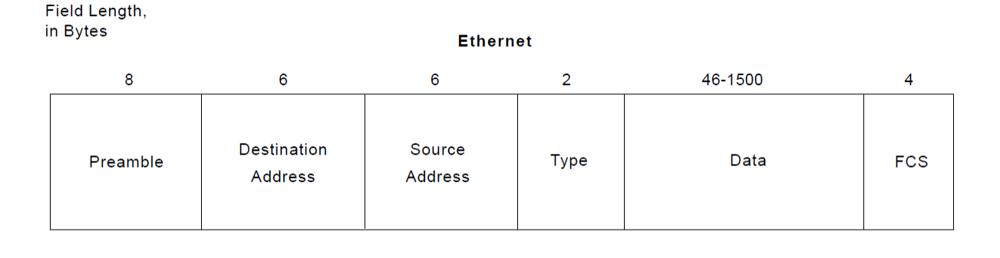
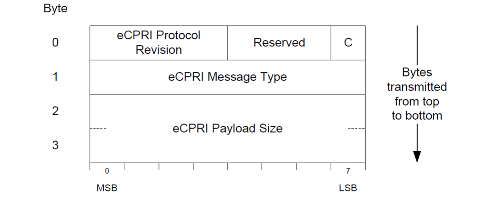
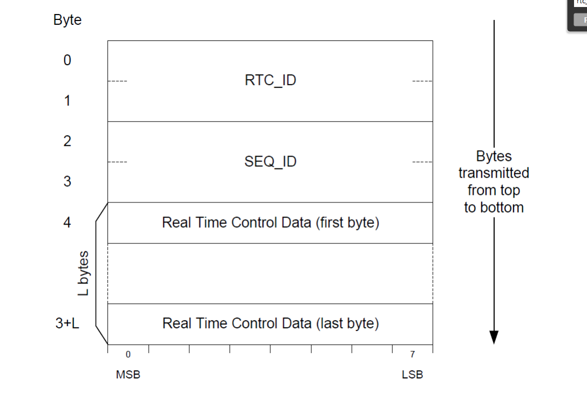
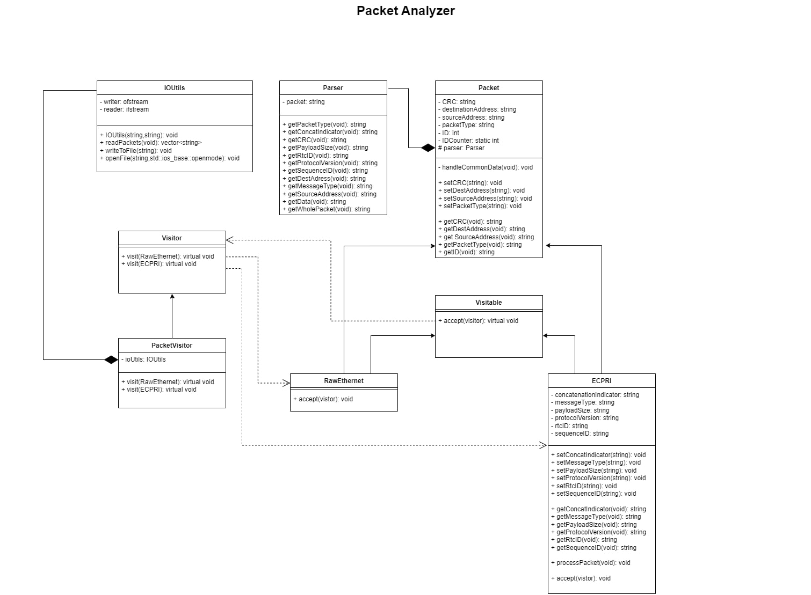

# Packet Analyzer

In the dynamic landscape of network technologies, the ability to analyze data packets is paramount for ensuring network security, optimizing performance, and troubleshooting issues effectively. A Packet Analyzer, also commonly referred to as a Packet Sniffer, stands as a pivotal tool in this realm. It serves as the cornerstone for network administrators, cybersecurity professionals, and developers, enabling them to dissect and comprehend the intricate details of data packets traversing a network.

A Packet Analyzer is a sophisticated software or hardware tool meticulously engineered to capture, interpret, and analyze data packets as they travel across a network infrastructure. By inspecting the packet headers, payloads, and various protocol information, it provides invaluable insights into network behavior, aiding professionals in diagnosing network anomalies, identifying security threats, and enhancing overall network efficiency.

The program designed to read an input file containing Ethernet packets, parse each packet into its individual fields, and then write the parsed packets with their fields into an output file. The input file consists of lines, each representing one packet of data. The packets can either be raw Ethernet frames or Enhanced Common Public Radio Interface (e-CPRI) frames built over Ethernet. The distinction between Ethernet frames and e-CPRI frames is made based on the Type field; if the Type field is "AEFE," the frame is identified as an e-CPRI frame.

### Ethernet Frame Structure

Ethernet packet is constructed as per the following figure:



e-CPRI frames, built over Ethernet, have the same fields as Ethernet frames but a different payload/data structure, including Common Header and Real-Time Control Data.

* Common Header :

  
* Real-Time Control Data:

  

## System Design



## How to Run the Program

Follow these steps to run the Packet Analyzer program:

1. **Clone the Repository:**

   ```bash
   git clone <repository-url>
   cd packet-Analyzer
   ```
2. **Compile the Program:**

   ```bash
   g++ -I./include -o my_program ./src/*.cpp
   ```
3. **Run the Program:**

   ```bash
   .\my_program.exe <input_file_path> <output_file_path>
   Ex: .\my_program.exe io/input_packets io/output_packets 
   ```
4. **Check the Output:**
   The parsed packets with their fields will be written to the `output_packets` file.

## References

- [Ethernet Frame](https://en.wikipedia.org/wiki/Ethernet_frame)
- [e-CPRI Specifications](http://www.cpri.info/downloads/eCPRI_v_2.0_2019_05_10c.pdf)
